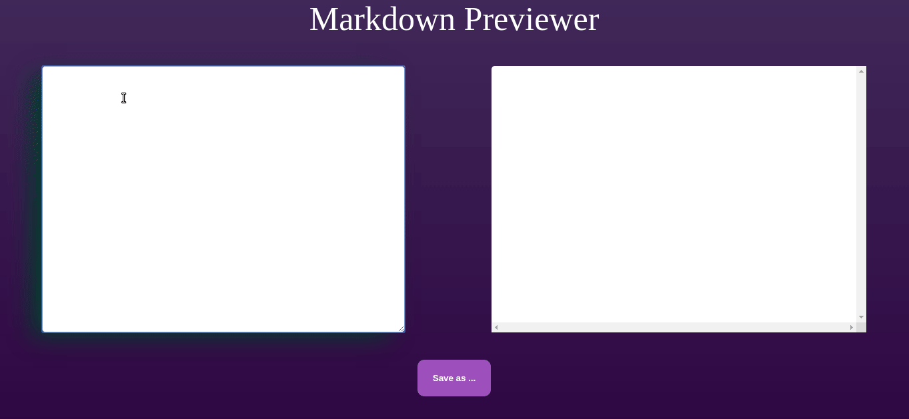

# Markdown-preview

A markdown preview feito a partir de uma ideia da repo https://github.com/florinpop17/app-ideas

Nele, Temos como editar e baixar os arquivos Readme.md criados lá. 

Feito em React para aprofundar conhecimentos. 

Para rodar basta ter o npm instalado e rodar no seu terminal: 

*npm install* e *depois npm start.*

